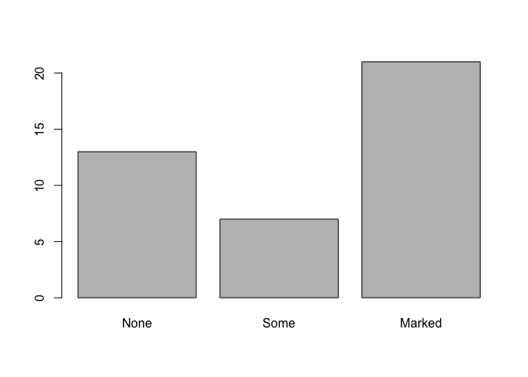
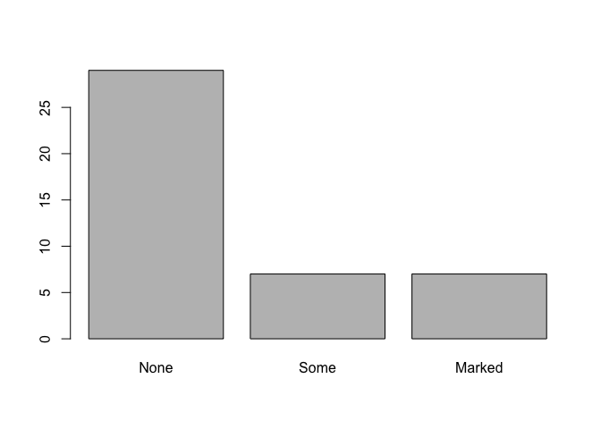
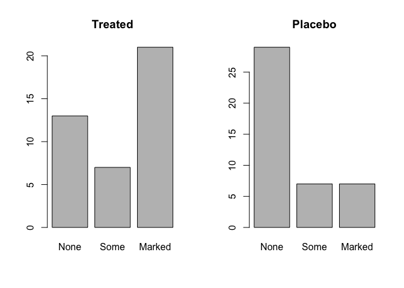

EVE 109 Section Week 9
================

### 1. Multiple plots

Often it's useful to look at multiple plots side by side. Today we'll learn an easy way to do that. Once again, we'll use the `Arthritis` dataset.

``` r
library(vcd)
```

    ## Loading required package: grid

``` r
data(Arthritis)
head(Arthritis)
```

    ##   ID Treatment  Sex Age Improved
    ## 1 57   Treated Male  27     Some
    ## 2 46   Treated Male  29     None
    ## 3 77   Treated Male  30     None
    ## 4 17   Treated Male  32   Marked
    ## 5 36   Treated Male  46   Marked
    ## 6 23   Treated Male  58   Marked

 

Maybe we want to compare outcomes for the treated vs. placebo patients. We could plot each like this:

``` r
treated <- subset(Arthritis,Treatment=="Treated")
table.treated <- table(treated$Improved)
barplot(table.treated)
```



``` r
placebo <- subset(Arthritis,Treatment=="Placebo")
table.placebo <- table(placebo$Improved)
barplot(table.placebo)
```



 

To really compare the results, though, it might be most useful to look at these side-by-side. We can to that by altering the graphical parameters:

``` r
par(mfrow=c(1,2)) # 1 row and two columns of plots
barplot(table.treated,main="Treated")
barplot(table.placebo,main="Placebo")
```



Now we can see that there is clearly more "Marked" improvement in the treated patients.

     

### 2. Intro to data from Portnoy et al. (2015)

Since you guys are all R experts now, this week you'll use the documentation to figure out the analysis on your own. First, though, I'll walk you through the data. We're using the SNP data from the Portnoy et al. (2015) paper. You'll need three different libraries (two new):

``` r
install.packages("vcfR")
install.packages("hierfstat")
```

``` r
library(vcfR)
library(hierfstat)
library(adegenet)
```

 

The SNP data for today is a VCF (Variant Call Format) file. This is a very common format for analyzing raw SNP data. Take a look at this file in a text editor. There's a lot of extra information that we do not need for our SNP analysis. We can use the `vcfR` library to read that file in and convert it to the *genind* format (remember we used this format to calculate heterozygosity?). This is the format that the `adegenet` package likes.

``` r
v <- read.vcfR("data/snp_data.vcf")
```

    ## Scanning file to determine attributes.
    ## File attributes:
    ##   meta lines: 64
    ##   header_line: 65
    ##   variant count: 5914
    ##   column count: 129
    ## 
    Meta line 64 read in.
    ## All meta lines processed.
    ## gt matrix initialized.
    ## Character matrix gt created.
    ##   Character matrix gt rows: 5914
    ##   Character matrix gt cols: 129
    ##   skip: 0
    ##   nrows: 5914
    ##   row_num: 0
    ## 
    Processed variant 1000
    Processed variant 2000
    Processed variant 3000
    Processed variant 4000
    Processed variant 5000
    Processed variant: 5914
    ## All variants processed

``` r
gen <- vcfR2genind(v)
gen
```

    ## /// GENIND OBJECT /////////
    ## 
    ##  // 120 individuals; 5,914 loci; 11,838 alleles; size: 8.7 Mb
    ## 
    ##  // Basic content
    ##    @tab:  120 x 11838 matrix of allele counts
    ##    @loc.n.all: number of alleles per locus (range: 2-3)
    ##    @loc.fac: locus factor for the 11838 columns of @tab
    ##    @all.names: list of allele names for each locus
    ##    @ploidy: ploidy of each individual  (range: 2-2)
    ##    @type:  codom
    ##    @call: adegenet::df2genind(X = t(x), sep = sep)
    ## 
    ##  // Optional content
    ##    - empty -

Let's explore this file a little:

``` r
dim(gen$tab) # gen$tab is a matrix where each row is an individual
```

    ## [1]   120 11838

``` r
head(gen$tab[,1:10])
```

    ##        E881_L109_46.0 E881_L109_46.1 E881_L109_71.0 E881_L109_71.1
    ## AK_001              2              0              2              0
    ## AK_003              2              0              2              0
    ## AK_004              1              1              1              1
    ## AK_005              1              1              1              1
    ## AK_006              2              0              2              0
    ## AK_007              1              1              1              1
    ##        E897_L100_57.0 E897_L100_57.1 E1071_L100_38.0 E1071_L100_38.1
    ## AK_001              2              0               2               0
    ## AK_003              2              0               0               2
    ## AK_004              2              0               2               0
    ## AK_005              2              0               2               0
    ## AK_006             NA             NA               2               0
    ## AK_007              1              1               2               0
    ##        E1071_L100_61.0 E1071_L100_61.1
    ## AK_001               1               1
    ## AK_003               2               0
    ## AK_004               2               0
    ## AK_005               2               0
    ## AK_006               2               0
    ## AK_007               2               0

``` r
rownames(gen$tab) #these are the sample names in order
```

    ##   [1] "AK_001" "AK_003" "AK_004" "AK_005" "AK_006" "AK_007" "AK_008"
    ##   [8] "AK_009" "AK_010" "AK_011" "AK_012" "AK_013" "AK_014" "AK_015"
    ##  [15] "AK_016" "AK_017" "AK_018" "AK_019" "AK_020" "AK_021" "AK_022"
    ##  [22] "AK_023" "AK_024" "AK_026" "AK_028" "AK_029" "AK_030" "AK_031"
    ##  [29] "AK_034" "AK_035" "AK_036" "LK_001" "LK_003" "LK_005" "LK_006"
    ##  [36] "LK_008" "LK_009" "LK_010" "LK_011" "LK_012" "LK_013" "LK_014"
    ##  [43] "LK_015" "LK_016" "LK_017" "LK_018" "LK_019" "LK_020" "LK_021"
    ##  [50] "LK_022" "LK_023" "LK_024" "LK_025" "LK_026" "LK_027" "LK_028"
    ##  [57] "LK_029" "LK_030" "LK_031" "LK_032" "LK_033" "LK_034" "NC_001"
    ##  [64] "NC_002" "NC_003" "NC_004" "NC_005" "NC_006" "NC_007" "NC_008"
    ##  [71] "NC_010" "NC_011" "NC_013" "NC_014" "NC_015" "NC_016" "NC_017"
    ##  [78] "NC_018" "NC_019" "NC_022" "NC_023" "NC_024" "NC_026" "NC_028"
    ##  [85] "PC_001" "PC_002" "PC_003" "PC_004" "PC_005" "PC_006" "PC_007"
    ##  [92] "PC_008" "PC_009" "PC_010" "PC_011" "PC_012" "PC_013" "PC_014"
    ##  [99] "PC_015" "PC_016" "PC_017" "PC_018" "PC_019" "PC_020" "PC_021"
    ## [106] "PC_022" "PC_024" "PC_025" "PC_026" "PC_027" "PC_028" "PC_029"
    ## [113] "PC_030" "PC_031" "PC_032" "PC_036" "PC_037" "PC_038" "PC_039"
    ## [120] "PC_040"

 

Now we can take a look at the metadata:

``` r
meta <- read.csv("data/metadata.csv")
head(meta)
```

    ##   Sample_Name Collection.Date Location.Code       Locality     Sex
    ## 1      NC_001        10/27/00            NC North Carolina Unknown
    ## 2      NC_002        10/27/00            NC North Carolina Unknown
    ## 3      NC_003        10/27/00            NC North Carolina Unknown
    ## 4      NC_004        10/27/00            NC North Carolina Unknown
    ## 5      NC_005        10/27/00            NC North Carolina Unknown
    ## 6      NC_006        10/27/00            NC North Carolina Unknown

The first column is the sample names, but notice they are in a different order than in your genotype object. Other columns you might be interested in are "Locality" and "Sex"

     

### Documentation

The main package we will use for analysis is `adegenet`. [Here is some helpful documentation](http://adegenet.r-forge.r-project.org/files/tutorial-basics.pdf).

Some helpful sections:   5.4 Measuring and testing population structure   6.2 Performing a Principal Component Analysis on genind objects

     

Homework
========

Use the data provided and the documentation to do the following:

### *Homework 8: Write a script that does the following:*

#### 1. Calculate Fst for males and females separately

#### 2. Create a 2-panel figure with separate PCAs for males and females.
